# Installing Metasploitable on Apple Silicon

For those using MacOS (Apple Silicon) who are willing to install the Metasploitable OS, the OS is built to be run on x86-64 architecture and therefore not compatible with the ARM architecture in your Apple device. Simply put, **your CPU cannot natively virtualize this x86-based OS**. When you simply plug in the downloaded VM drive or equivalent into your VirtualBox software, you might run into issues adding the VM or getting it booted up, since VirtualBox is not that good at running an OS built with a different CPU architecture than your own device.

Fortunately, instead of virtualizing the OS, we can **emulate** it. Simply put, virtualization is just utilizing your own CPU to run another OS, but emulation is simulating a completely different CPU and translating its machine language in real time. For example, running Windows 86 on a VirtualBox on a Windows machine? Sure, why not? They are all running on x86 architecture. But on a MacBook Air M4? Welp, it's like two completely different universes for them. Therefore, we have to emulate it.

Now that the architecture mismatch makes sense, let's actually get the VM running.

## First Step: Install UTM

Not *University Teknologi Malaysia* ya, it's a software (for MacOS only) capable of doing virtualization / full system emulation. Can you ditch VirtualBox after installing UTM? I mean, VirtualBox is still preferred for virtualizing OS built with the same architecture as your own device, and UTM, despite being powerful in terms of compatibility, still has its trade-off: slow. It has to translate every line of machine instruction from one architecture to another in real time, so don't expect it to be capable of running performance-critical stuff. Analogically, it's equivalent to simultaneously translating a conversation while speaking.

Download it here: [https://mac.getutm.app/](https://mac.getutm.app/)

I will assume that you've already know how to install an app on MacOS. After the installation, start the app, and you should be able to see something like this.

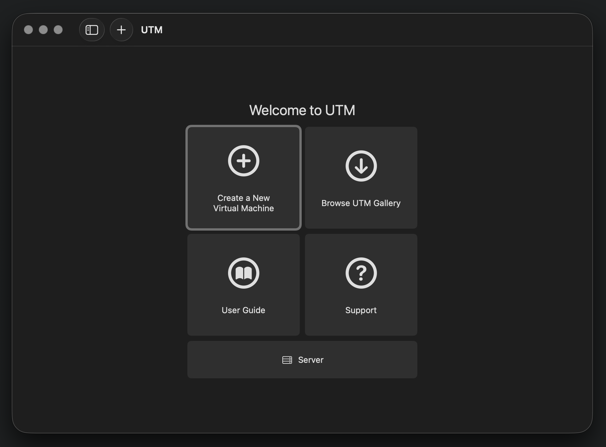

After that, you should be good to go. Time to download the OS.

## Second Step: Download and Install the OS

Go on Google and type in **Metasploitable OS download**, and the first link from *Rapid 7* is the one you are looking for.

If you're lazy to do the search, here you go: [https://docs.rapid7.com/metasploit/metasploitable-2/](https://docs.rapid7.com/metasploit/metasploitable-2/)

Download it, extract it (don't tell me you don't know how to unzip a file), and you'll see the following:

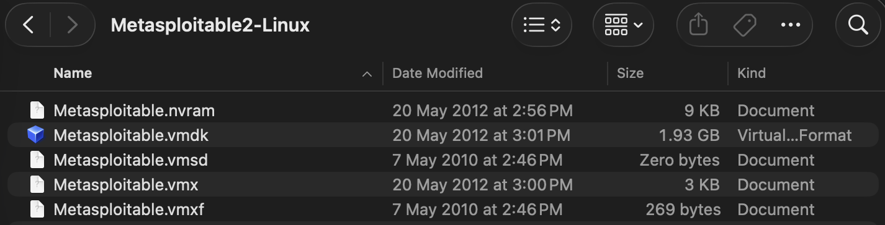

You should see there is a file that ends with the `.vmdk` extension, it just so happens to be the largest file in the entire folder. That's what we are looking for, the file containing the drive of the actual OS. 

Next, head back to your UTM interface, and click on the **Create a new Virtual Machine** button at the top left corner of the 2x2 grid. The one with the plus icon.

Another dialog should popup asking whether you want to Virtualize or Emulate. Click on **Emulate**.

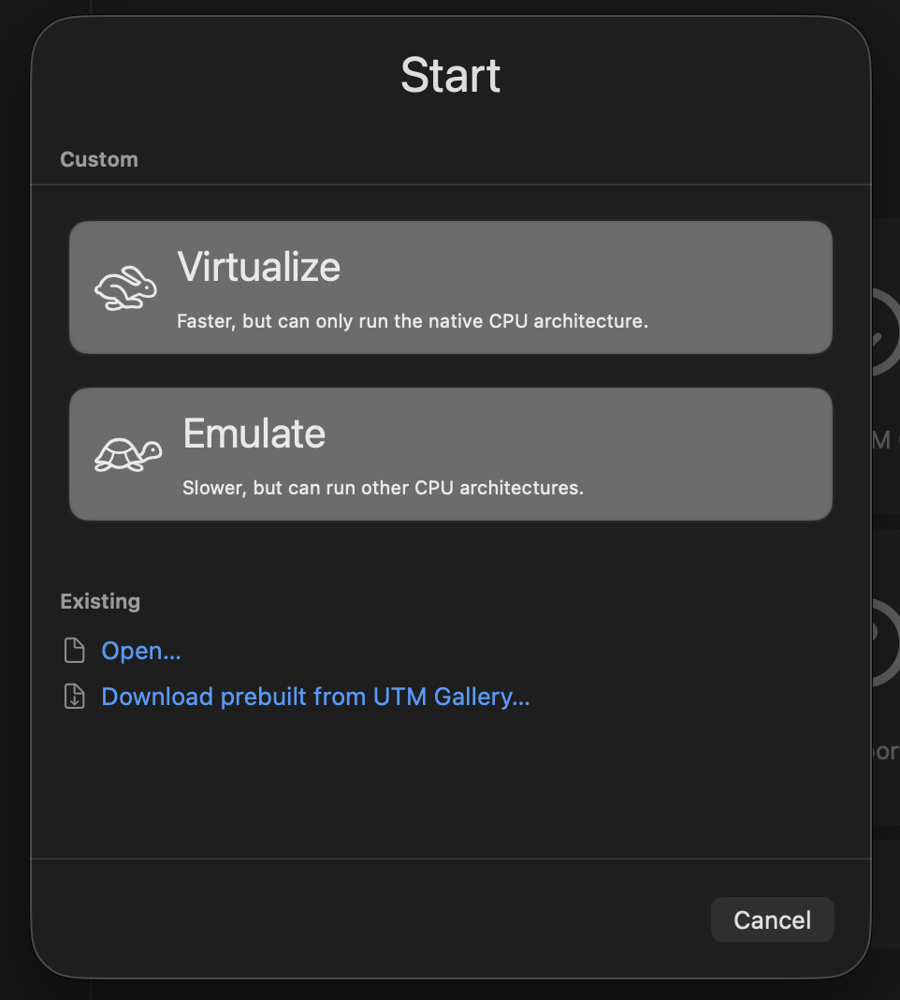

After that, on the screen that asks you to select with Operating System you're targetting, you should know which one to select. In case you don't, click on **Linux**.

Then a scary screen will pop up showing a list of scary options that might look like gibberish to you. Don't worry, those are just some different kinds of machines with various hardware architectures (chipset, firmware, bus architecture, etc.) from very legacy ones to modern ones that we are using daily that you can choose to run your OS on. 

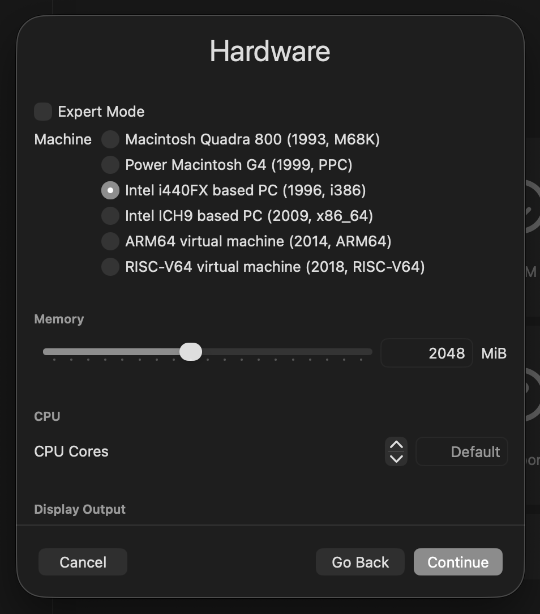

In case you're wondering:

1. **Macintosh Quadra 800 (1993, M68K):** Macintosh computers from the stone age.
2. **Power Macintosh G4 (1999, PPC):** Macintosh computers before Intel Mac
3. **Intel i440FX based PC (1996, i386):** Legacy PC running on legacy BIOS where operating systems still assumed the internet was a friendly place.
4. **Intel ICH9 based PC (2009, x86_64):** More modern x86 PCs capable of running modern operating systems (Windows 10, most modern Linux, etc.)
5. **ARM64 virtual machine (2014, ARM64):** Modern day PC running on the ARM architecture. FYI Apple Silicon itself is also ARM-based. You can run Windows ARM, Ubuntu ARM, Kali ARM, whatever ARM, or Hackintosh if you want lol 
6. **RISC-V64 virtual machine (2018, RISC-V64):** An open-source instruction set architecture (ISA). Geeky and nerdy stuff made by geeks and nerds who decide to reinvent the civilization. Feel free to dive deeper if you're interested.

Can you guess which one we are going to use? If you say the **Intel i440FX based PC (1996, i386)**, congratulations! But unfortunately no candy for you today. Under the machine selection is the RAM allocation slider, for you to adjust how much RAM you wanna allocate for your tiny little virtual machine. 512MB or 1024MB should be more than enough for our case.

Press Next, and now you'll be prompted to import the whatever ISO image or drive image you want to run. Under the *Boot Image Type* field, select **Import existing drive**. Then, press the **Browse** button, and select the `.vmdk` file that you've downloaded earlier.

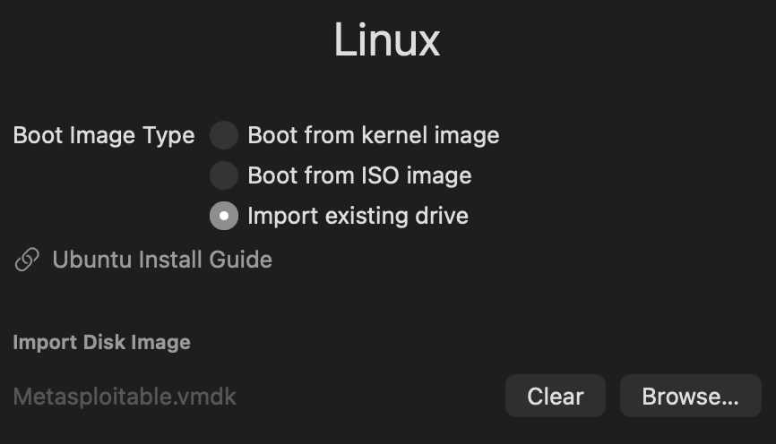

Press continue until you reach the Summary page. Nothing requires explicit configuration before that. In the screen, feel free to give your cute little VM a cool name. Put whatever suits your heart's content; this will not affect the running of your VM. After that, press that juicy **Save** button, and you should be one final step away from the actual boot up.

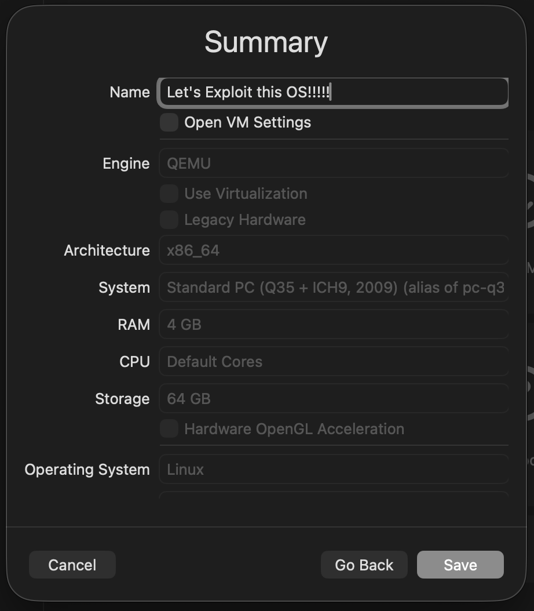

After the VM is created, you should see it appearing in the sidebar of the UTM interface.

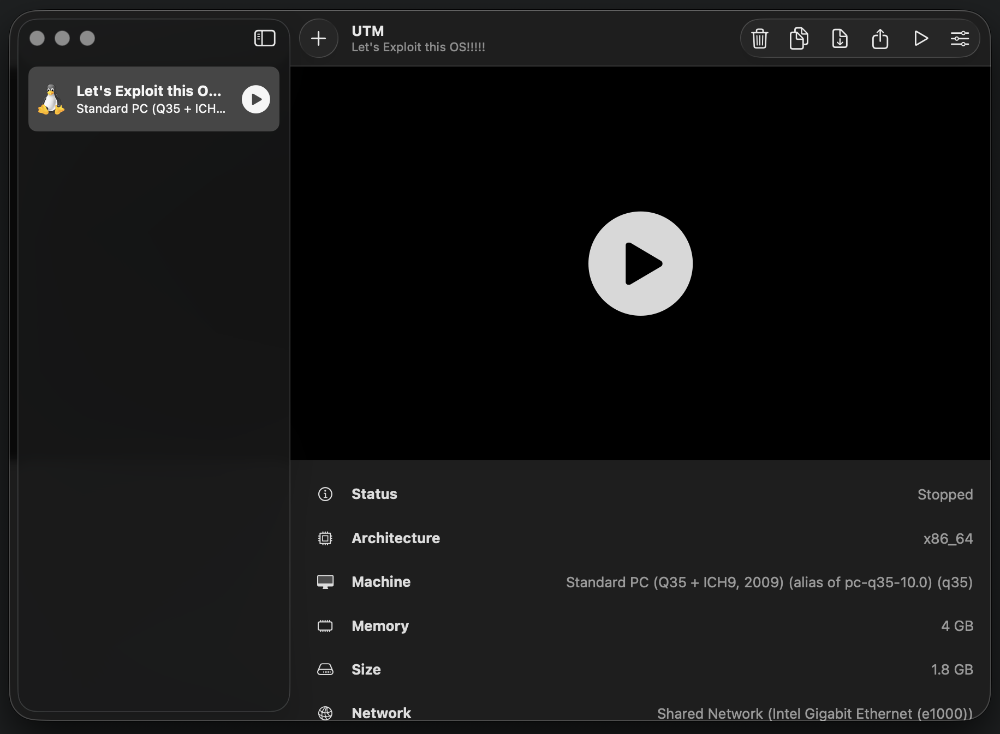

Next, right click on the VM in the sidebar, and click **Edit**. In the configuration sidebar, find the **Display** menu, and make sure the **Emulated Display Card** is set to **VGA**, as shown in the figure below. Then, press **Save**.

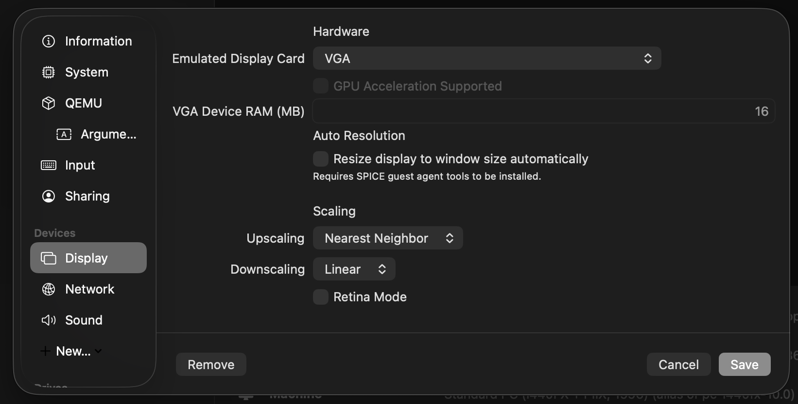

## Finally: Booting Up the VM

Yup, we're done with the installation and setup. Time to fire it up. Press on the play icon, either in the sidebar, or the main section. You'll know that you've come to a success when you see the screen like the one below:

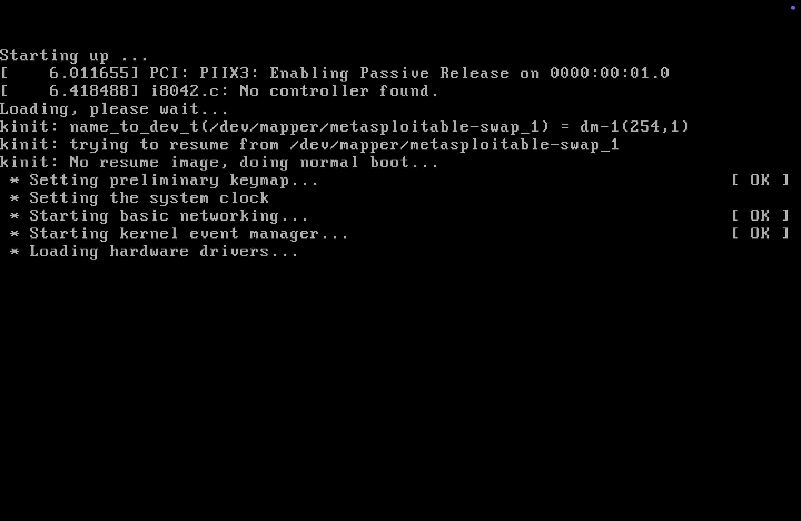

Wait for a while, and you'll see the gorgeous ASCII art of the Metasploitable logo showing up, following by a login prompt:

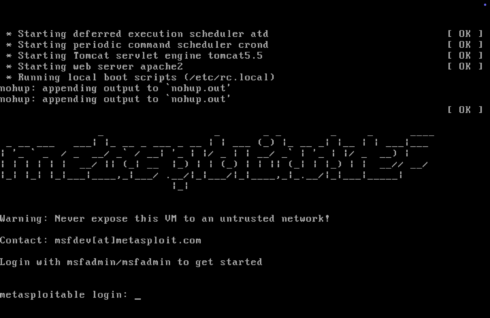

Type in `msfadmin` for both the username and the password, and you should be logged into the OS. Keep in mind that when entering the password, the text you have entered will not show up (for privacy reason, obviously). Just keep track on what you've entered in mind, and when you're done with it, pressed the enter key as usual.

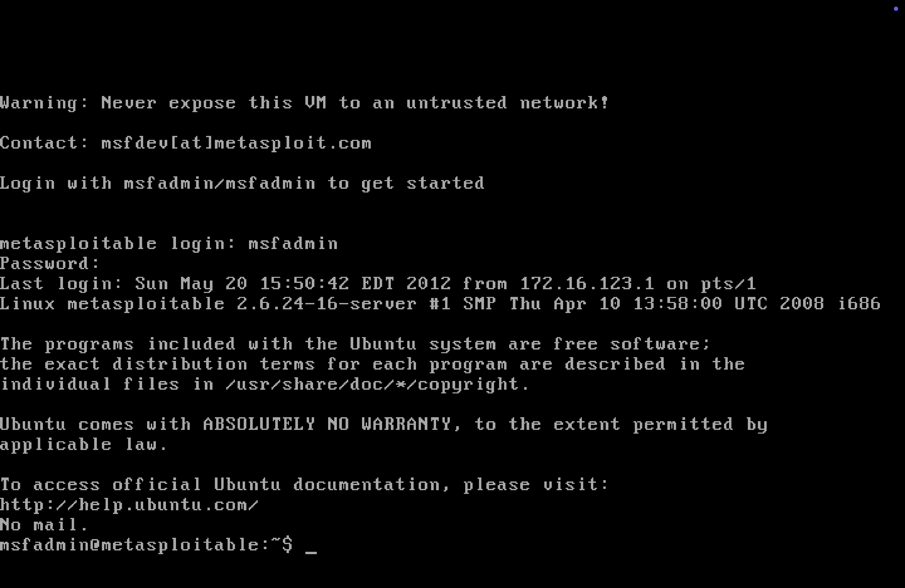

**Happy exploiting!**