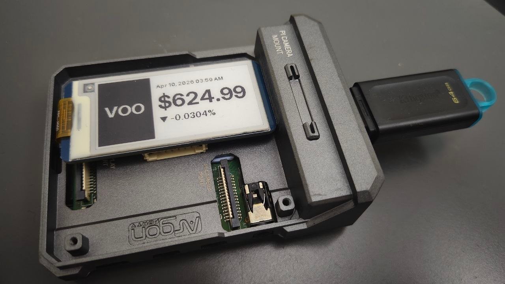

# An Attempt to Create an e-Ink Stock Display using Raspi Zero

All of these started when I decided to allocate part of my cash into buying some ETFs in an effort to gain some passive wealth growth. As of the time of writing, a decent chunk of my personal assets has been utilized for purchasing the Vanguard S&P 500 ETF (VOO). The reason behind this is pretty straightforward: VOO is an aggregation of the leading 500 listed companies in the US market, so no extra mental energy is required to determine whether a specific stock is worth investing in.

Despite a fixed investment routine aimed at long-term capital growth, I was still curious about the rise and fall of the stuff I am currently investing in. My mobile phone is, of course, a pretty handy tool to keep track of them through [MooMoo](https://www.moomoo.com), the investment platform I am currently using, but I've always wanted some sort of display on my desk that is always there, showing the number I was keeping an eye on.

We must all agree that the algorithms nowadays are extremely ubiquitous. When I was having the idea of building such a desktop widget for stock display, I started to stumble upon ads when I was scrolling Facebook, promoting a product that was built to tailor to my exact requirements. It was called [TickrMeter](https://tickrmeter.com/), a clean little desktop e-ink stock display widget. 

Then I was like, if the price is affordable enough, I might as well just get one myself and proceed with whatever I was doing in my life. Then, of course, just like any other startup projects based in Western countries, the prices are always shocking to me as a Malaysian student. One unit for RM320. I am not saying that this price is ridiculous or anywhere near unreasonable, but for just the price of a little desktop e-ink stock display widget, I could've eaten a whole month of chicken rice as lunch.

So yeah, being a geek who loves tinkering around with stuff, why don't I just... express my gratitude to the idea by... making one myself? And if you're reading this article, you know that this idea has been brought to life, costing half the price of the original item being sold. That's how a maker makes their life better in an affordable way.

> [!Warning]
> ### Disclaimer Before We Start
>
> This project serves solely as an open-source alternative to the TickrMeter project, with my own touches integrated into it. Some technical knowledges are required, and if you are not willing to waste your precious brain cells setting up one yourself, consider buying one from the TickrMeter official website so you can enjoy the product that works out of the box without any hassle.

## What We Will be Building

Fairly straightforward: **a desktop stock ticker meter display widget built with an e-ink screen and Raspberry Pi Zero**.

Despite its limited computing power, A Raspberry Pi Zero is, after all, still a computer running Linux. Therefore, simply running a stock display on it would be a huge underutilization of its capability. Therefore, it wouldn't be strenuous to run a full-flex configuration portal on it, which can be used to customize which symbol we want to display on the widget anytime. 

However, there is still a critical issue that must be tackled: it relies on the Internet to fetch the stock data. Therefore, we need a way to tell the device which WiFi address to connect to, since at the very end, the device won't be connected to any external input device. But fortunately, it isn't rocket science. With some simple *Host Access Point Daemon (Hostapd)* setup, we can easily create a WiFi access point that you can connect to with your phone, access the WiFi configuration portal, select your WiFi, enter the password, and wallah, now your device is connected to the world.

After the device has been configured, it will then expose another portal that allows you to set the symbol that you want the ticker to be displayed. It's hosted locally on your little Raspi, and only people who are connected to the same WiFi network will be able to access the portal, so you don't have to worry about the device being hacked. With a little bit more configuration, you can even make your device accessible through a local domain instead of the IP, so that you don't have to memorize and type in a long string of numbers with dots in between every time you want to access the config portal.

To be continued...